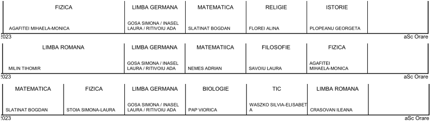

```{r, include = FALSE}
knitr::opts_chunk$set(
  collapse = TRUE,
  comment = "#>"
)
```

```{r setup}
library(refitgaps)
```

## Introducere

În imaginea de mai jos am extras dintr-un fișier PDF găsit pe website-ul unei anumite școli, orarele pe o aceeași zi (ultima, observând că este urmată de subsolul de pagină) pentru trei clase:

```{r out.width = '99%', echo=FALSE}

```
Să observăm că în ora a treia a zilei respective, fiecare dintre cele trei clase are de făcut câte o lecție de "GERMANA", cu... aceiași *trei* profesori (cu numele separate prin '/', în celulele redate); avem aici un exemplu tipic de **tuplaj**: elevii reuniți din clasele inițiale sunt despărțiți *ad-hoc*, după anumite criterii, constituind trei noi clase (pentru care se păstrează numele de clasă inițiale) și în ora respectivă, la fiecare dintre cele trei clase formate astfel, intră câte unul dintre cei trei profesori.

Mai jos vom introduce anumite convenții de notație, prin care tuplajul evidențiat mai sus s-ar reprezenta numind profesorii și apoi clasele pe care sunt tuplați: `(Gr1 Gr2 Gr3) / (9A 9B 9C)` --- urmând să ținem seama pe parcurs, de cerința ca aceste trei lecții să cadă într-o *aceeași oră* a zilei.

Regula de bază pentru *corectitudinea* unui orar este următoarea: în oricare oră din programul zilei, fiecare clasă (respectiv, profesor) face o singură lecție, cu un singur profesor (respectiv, clasă).

Ce ar însemna atunci, dacă ar fi fost specificați nu trei, ci patru profesori, într-o aceeași oră la cele trei clase: `(Gr1 Gr2 Gr3 Fr2) / (9A 9B 9C)`? După regula de corectitudine menționată, trebuie să ne gândim că doi dintre acești patru profesori (să zicem ultimii doi) constituie un **cuplaj** pe una dintre clase: aceasta, să zicem  `9C` (formată mai înainte, din elevi proveniți de la cele trei clase inițiale) este despărțită în două "grupe" de elevi, iar `Gr3` și `Fr2` fac lecție în ora respectivă cu câte una dintre aceste "jumătăți" ale clasei `9C` (notația tuplajului devine `(Gr1 Gr2 Gr3Fr2) / (9A 9B 9C)`).

În *planul de încadrare* pregătit la începutul anului școlar de către conducerea școlii, se precizează pentru fiecare profesor al școlii, numele și prenumele, gradul didactic, disciplinele pe care este încadrat, clasele repartizate și numărul corespunzător de ore, ETC. Normativele existente asupra numărului maximal de ore pe profesor, pe clasă și pe obiect fac posibilă încropirea unui *orar* săptămânal, pentru desfășurarea tuturor lecțiilor `prof/obj/cls` prevăzute în planul de încadrare (și de fapt, sunt posibile *foarte multe* orare, mai bune sau mai rele, pentru un același set de lecții).
 
De obicei, mai în toate școlile, orarul școlar este produs prin aplicația comercială [ascTimetables](https://www.asctimetables.com/) (sau varianta românească *aSc Orare*, semnată în subsolurile de pagină cuprinse în imaginea de mai sus); pe de altă parte, ca teorie, "problema orarului școlar" (*School Timetable Problem*) are o vechime consistentă de peste 50 de ani, fiind tratată mai peste tot ca "problemă combinatorială de optimizare" (*v.* de exemplu: Pillay, N. (2014).*A Survey of School Timetabling Research*.Annals of OperationsResearch, 218(1), 261-293).

Dar putem vedea *STP* și așa: se dă un *set de date*, conținând toate lecțiile `prof/cls` desprinse din planul de încadrare al școlii; acest set inițial trebuie completat cu o coloană `zi` pe care să se înscrie *ziua* din săptămână în care este repartizată fiecare lecție, astfel încât repartiția pe zile rezultată să fie *echilibrată* pe zile, pe profesori și pe clase. Apoi, fiecare dintre subseturile de lecții repartizate în câte o aceeași zi, trebuie completat cu o coloană `ora` având ca valori acea oră `1:7` a zilei, în care trebuie alocată fiecare dintre lecțiile respective - astfel încât oricare două lecții să *nu* se suprapună într-o aceeași oră a zilei (ceea ce a constituit subiectul pachetului `https://cran.r-project.org/package=hours2lessons`).

Ar rezulta astfel câte un *orar*, pentru fiecare zi în parte; problema care se mai pune constă în ajustarea orarului zilei, astfel încât numărul total de *ferestre* să devină cât se poate de mic (și aceasta constituie tema pachetului de față).\
Un orar săptămânal ar fi și "bun", dacă: este echilibrat (în fiecare zi, avem cam același număr de lecții; lecțiile fiecărui profesor, ca și cele ale fiecărei clase, ca și cele pe un același obiect la fiecare clasă, sunt repartizate *uniform*, pe zile); numărul total de ferestre este unul rezonabil, cât se poate de mic.  

Pentru a constitui setul inițial de date, *nu* avem nevoie de numele și prenumele profesorilor, nici de denumirile adoptate pentru disciplinele școlare; cel mai convenabil este să *abreviem* disciplinele pe câte două litere și să desemnăm profesorii concatenând numele abreviat al disciplinei principale pe care este încadrat fiecare, cu un număr de ordine între cei de pe o aceeași disciplină. De exemplu, `Bi1`, `Bi2` și `Bi3` ar reprezenta cei trei profesori de "Biologie", iar `Gr3Fr2` ar fi un profesor "fictiv" pentru lecțiile "pe grupe" ale unei clase (în ora respectivă, `Fr2` face "Franceză" cu o grupă, iar `Gr3` face "Germană" cu cealaltă grupă). 

De observat că pentru lecțiile dintr-o aceeași zi, nu este necesar să păstrăm câmpul `zi`; deasemenea, nu mai este necesar să păstrăm câmpul `obj`: disciplina principală se deduce din codul profesorului (iar pentru eventualele discipline secundare, putem prevedea din start un dicționar separat). 

Deci orarul constituit pentru lecțiile unei zile fixate, constă din trei câmpuri: `prof/cls/ora`. Desigur, trebuie respectată condiția de ne-suprapunere a lecțiilor (de exemplu, oricare lecție a cuplajului `Gr3Fr2` trebuie să nu se suprapună într-o aceeași oră nici cu vreuna dintre lecțiile lui `Gr3` și nici cu vreuna dintre cele ale lui `Fr2`, dacă aceștia au și "ore proprii" pe lângă cele din cuplaj); se impune firesc, să constituim în prealabil un "dicționar" care să reflecte dependențele între lecțiile celor angajați în cuplaje; dacă este cazul, trebuie specificate în prealabil și tuplajele existente. 

Ferestrele se pot vedea cel mai ușor transformând orarul din "formatul lung" `prof/cls/ora` în "matrice-orar" pe profesori (*v.* `hours2lessons::long2matrix()`); de exemplu:

```{verbatim}
    prof   1   2   3   4   5   6   7
    Gg1    9E  10B 5A  -   -   9D  -   # două ferestre, în orele 4 și 5
    Gg2    -   7B  6A  8B  9F  -   -   # nu are ferestre
    Li1    10B -   12A -   -   -   -   # are 4 ore (o fereastră "ascunsă")
    Li1Li3 -   -   -   11A -   -   - 
    Li2    -   -   -   9D  -   5B  -   # are 4 ore, cu două ferestre (în orele 3, 5)
    Li2Li1 -   10A -   -   -   -   - 
    Li2Li3 9A  -   -   -   -   -   - 
    Li3    -   11B -   -   11A -   -   # are o fereastră (în ora 3)
```
În orarul de pe care am extras liniile de mai sus, `Gg*` nu apar în vreun cuplaj; în schimb, calculul ferestrelor pentru cei trei profesori `Li*` este mai dificil, fiindcă ei intră în cuplaje și au și ore proprii. Pe linia lui `Li1` apare o fereastră, dar este o fereastră *falsă*, fiindcă în ora 2 `Li1` are lecție împreună cu `Li2` la clasa `10A`; se vede ușor că `Li1` are de făcut nu două lecții câte apar pe linia proprie, ci 4 lecții, în orele `1:4` (fără nicio fereastră). `Li2` are lecții, singur sau în cuplaje, în orele 1, 2, 4 și 6, deci are două ferestre (dintre care, una "ascunsă" în ora 3). `Li3` are 4 ore, cu o fereastră în ora 3.\
Deci în total, secvența de orar redată mai sus conține 5 ferestre.

Bineînțeles că socotim numai ferestrele profesorilor reali, nu și ale celor "fictivi"; dar poate exista o excepție: dacă un profesor nu are ore proprii, ci are ore numai într-un cuplaj, atunci ferestre cuplajului respectiv reprezintă ferestre ale profesorului *extern* (fără ore proprii) implicat în cuplaj.

## Cum acoperim o fereastră? Reducerea numărului de ferestre

Proprietatea principală a unei matrice-orar este aceea că fiecare clasă apare o singură dată pe fiecare coloană orară de rang cel mult egal cu numărul de ore/zi ale clasei respective (altfel, ar fi doi profesori la aceeași clasă, într-o aceeași oră). 

În setul de linii redat mai sus, `Gg1` are două ferestre, în orele 4 și 5; le-am putea elimina mutând `9D` din coloana 6 în coloana 4 (ar rezulta orarul individual fără ferestre `9E 10B 5A 9D - - -`) --- dar `9D` *exista deja* în coloana 4, pe linia lui `Li2`; deci, pentru a păstra unicitatea clasei pe coloană, trebuie să continuăm mutările de clase între cele două coloane: interschimbă `9D` din coloana 4 cu `5B` din coloana 6, apoi `5B` care se găsea deja pe o anumită linie în coloana 4, cu clasa existentă pe linia respectivă în coloana 6, și așa mai departe.

Secvența de mutări succesive care asigură  schimbarea unei clase dintr-o coloană în alta, păstrând unicitatea pe coloane a fiecărei clase, formează un *circuit* al grafului $\Gamma$ care are drept arce perechile (q1 q2) de pe liniile setului constituit de cele două coloane orare; dat fiind că singura valoare care se poate repeta pe o coloană este "`-`" (oră liberă, nu și vreo clasă), rezultă că circuitele lui $\Gamma$ fie trec prin vârful "`-`", fie sunt componente conexe (și sunt *lanțuri Kempe* ale lui $\Gamma$; *v.* `https://en.wikipedia.org/wiki/Kempe_chain`).

Funcția *internă* `move_cls()` asigură mutarea unei clase din coloana care o conține într-o altă coloană, modelând parcurgerea lanțului Kempe care conține clasa respectivă (din graful $\Gamma$ asociat celor două coloane) și returnează matricea-orar rezultată astfel --- sau `NULL`, în trei cazuri: când rangul coloanei-destinație depășește numărul de ore/zi ale clasei; când lanțul Kempe respectiv, conține o clasă care *nu* poate fi mutată într-o altă coloană, fiind dintre cele angajate în tuplaje; respectiv, când prin efectuarea mutării cerute, ar rezulta o suprapunere între un cuplaj și vreunul dintre membrii acestuia. 

Pe de altă parte, avem o listă internă 'SBC', care asociază fiecărui șablon de orar individual cu ferestre, mutările de clasă dintr-o coloană în alta care ar modifica (nu neapărat în jos) numărul de ferestre din șablonul orar respectiv; de exemplu, pentru șablonul "`-*--***`" (de patru lecții cu două ferestre) avem:

```{verbatim}
  h1 h2  result   # mută '*' din locul h1, în locul h2
1  2  3 --*-***  
2  2  4 ---****   # s-ar elimina ambele ferestre inițiale
3  5  3 -**--**   # două ferestre, în loc de singura inițială
4  5  4 -*-*-**
5  6  3 -**-*-*
6  6  4 -*-**-*
7  7  1 **--**-
8  7  3 -**-**-
9  7  4 -*-***-   # de parcă șablonul inițial a fost translatat cu o poziție
```
Am inclus și mutări care *măresc* numărul de ferestre din șablonul individual respectiv (dar am exclus mutări care duc la apariția a 3 sau mai multe ferestre; de exemplu, în lista de mutări de mai sus nu avem și mutarea (3 1), care ar duce la un șablon cu trei ferestre) --- pentru că urmărim să reducem numărul *total* de ferestre (și nicidecum, dintr-un *anumit* orar individual).

Ideea de bază a programului de reducere a numărului total de ferestre (modelată în funcția publică `recast()`) este următoarea: din matricea-orar *curentă* se aleg la întâmplare, câteva dintre liniile cu ferestre și se execută (prin `move_cls()`) una oarecare, dintre mutările asociate prin 'SBC' șabloanelor de orar de pe liniile respective; dacă matricea-orar rezultată are mai puține ferestre, sau măcar tot atâtea ca matricea-orar curentă, atunci ea devine noua matrice *curentă* și lucrul se reia asupra acesteia; dacă după un anumit număr de iterații (suficient de mare, dar... rezonabil), numărul de ferestre din orarul curent nu mai poate fi coborât, atunci se încheie, returnând ultima matrice-orar "curentă" (care de regulă, are un număr acceptabil de ferestre, iar uneori, poate după mai multe invocări `recast()`, chiar unul *minim posibil*). 

Fiind implicate aspecte aleatorii, la fiecare nouă invocare a funcției `recast()` va rezulta un alt orar, cu altă alocare de ore și eventual cu alt număr de ferestre.

## Un exemplu de lucru

Am încorporat o matrice-orar '`MOZ`' obținută anterior prin pachetul `hours2lessons` (... deci una care sigur, are *multe* ferestre), împreună cu setul de tuplaje '`TPL`' asociat ei; ținând seama că prima coloană conține toate clasele câte o singură dată, putem afla numărul de clase:

```{r}
sum(MOZ[, 1] != "-")  # numărul de clase prezente în orar
```
Dar să aflăm mai degrabă, numărul de ferestre:

```{r}
HG <- have_gaps(MOZ)  # subsetul liniilor pe care există ferestre
stringr::str_extract(HG$ore, "\\*.+\\*") %>%
    paste0(collapse = "") %>% stringr::str_count("-")
```
Dacă ne gândim că pe primele 6 coloane avem câte 32 de clase (poate ceva mai puține, în a 6-a oră) și adăugăm câteva clase care apar și în a 7-a coloană orară --- deducem că în `MOZ` avem în total cam 200 de lecții, față de care proporția celor 42 de ferestre (cam 20%) este chiar foarte mare...\
Ar fi acceptabil să avem numai vreo 5% ferestre (față de totalul lecțiilor), iar aceasta este chiar posibil, dacă setul tuplajelor nu este prea mare, sau întortochiat.

Repetăm execuția lui `recast()` până ce rezultă un orar cu mai puțin de 10 ferestre:

```{r eval = FALSE}
prnTime <- function(NL = " ")  # afișează timpul curent
    cat(strftime(Sys.time(), format = "%H:%M:%S"), NL)
prnTime("\n")
repeat {
    ORR <- recast(MOZ, TPL)
    cat(ORR[[2]], " gaps ")
    prnTime('\n')
    if(ORR[[2]] < 10) break
}
```
Redăm parcursul a *două* execuții ale secvenței de mai sus:

```{verbatim}
    04:13:06                04:30:54 
    11  gaps 04:13:48       13  gaps 04:31:34
    11  gaps 04:14:28       13  gaps 04:32:15 
    11  gaps 04:15:08       11  gaps 04:32:54 
    11  gaps 04:15:49       14  gaps 04:33:36 
    10  gaps 04:16:29       7  gaps 04:34:15 
    14  gaps 04:17:10 
    12  gaps 04:17:51 
    12  gaps 04:18:32 
    8  gaps 04:19:12 
``` 

În cele două execuții am ajuns la un orar cu 8 și respectiv, 7 ferestre (în 6 și respectiv, 3 minute); cu `have_gaps(ORR[[1]])` am putut constata cum sunt distribuite ferestrele respective pe profesori --- în primul caz avem 8 profesori cu câte o fereastră și l-am prefera celuilalt caz, în care ne-au rezultat 5 profesori cu câte o fereastră și unul cu *două* ferestre (desigur, executând pe un alt calculator, în alt moment de timp, rezultatele vor fi altele decât cele evocate mai sus).
 


 


